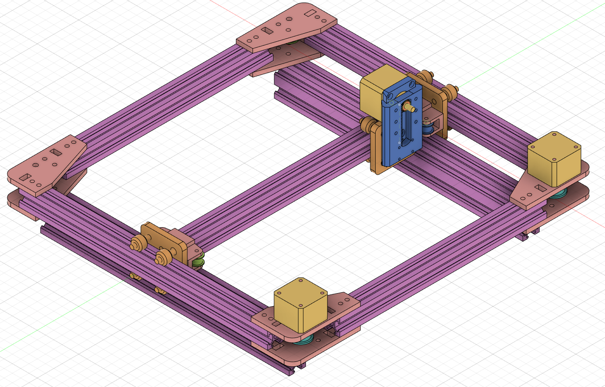

# CoreXY Laser Engraver and Pen Plotter
This is my repository to document my laser engraver project. It has gone through multiple iterations and currently is inspired by the [H-bot](https://openbuilds.com/?id=274) design.

This is a new version which is a bit smaller in form, as my last design was still to big for my student studio. I also haven't used the laser yet as I do not have a safe enclosure, so I just use it as a pen plotter right now.

## Design goals and constraints
* The XY-plane covered by the laser must be minimum 200 by 200 mm (This design is theoretically 200mm by infinite)
* The motors moving the laser on the XY-plane must be stationary.
* The laser must be able to cut 3mm multiplex, preferably 5mm.
* The machine must be rigid enough to not need fixture onto anything.
* The machine must be quiet enough to be used within my student studio.

## To do
* Add clamps to allow for a glass/wooden bed
* Design an enclosure for the controllers and power supplies
* Design an enclosure for safety
* Design a fume extraction method

## Current design overview

*All of the tan colored items and the blue pinion and rack in the picture above are 3D printed parts. Others are not.*

## Parts used
Not 3D printed:
* 2x 250mm 2020 Vslot extrusion
* 3x 300mm 2020 Vslot extrusion
* 2x 300mm 2040 Vslot extrusion
* 3x [Mini Vslot gantry](https://grabcad.com/library/mini-v-gantry-kit-1)
* 4x [F625ZZ flanged ball bearing](https://reprap.org/wiki/Ball_bearing)
* 4x [GT2Pulley](https://www.tinytronics.nl/shop/nl/3d-printen/onderdelen/gt2-16-pulley-tandloos-3mm-as-met-rollager)
* 2x [Belt (G2T) Pulley 30 teeth](https://grabcad.com/library/gt2-timing-pulley-30-tooth-1)
* 1x [G2T timing belt](https://reprap.org/wiki/GT2_Timing_Belt)
* 3x [Nema 14 motors](https://www.omc-stepperonline.com/nema-14-stepper-motor/nema-14-bipolar-1-8deg-14ncm-20oz-in-0-4a-12v-35x35x26mm-4-wires.html)
* 1x [3.5 Watt laser module (includes driver and power supply)](https://www.banggood.com/nl/LA03-3500-450nm-3_5W-Blue-Laser-Module-TTL-Modulation-Fan-Heat-Sink-for-EleksMaker-DIY-Engraver-p-1103261.html?rmmds=category&cur_warehouse=CN)
* 1x [Arduino Uno](https://store.arduino.cc/arduino-uno-rev3)
* 1x [CNC shield v3](https://blog.protoneer.co.nz/arduino-cnc-shield/)
* 1x [40 Watt 12V power supply](http://www.meanwell.nl/products/Meanwell-RS-50-12---PSU-enclosed-12V-42A__RS-50-12.aspx)

3D printed:
* 2x motor plate for 2020 extrusion mount [model](./3D_prints/current/XaxisMotorMount.stl)
* 2x top plate for 2020 extrusion mount [model](./3D_prints/current/XaxisMotorTop.stl)
* 4x [model](./3D_prints/current/XaxisPulleyMount.stl)
* 8x [2020blocker](./3D_prints/current/2020Blocker.stl)
* 2x [YaxisMount](./3D_prints/current/YaxisMount.stl)
* 1x [PinionRackA](./3D_prints/current/PinionRackA.stl)
* 1x [PinionRackB](./3D_prints/current/PinionRackB.stl)

## Notes
* maybe letting the pinion and rack models be made out of metal will make the machine more rigid
