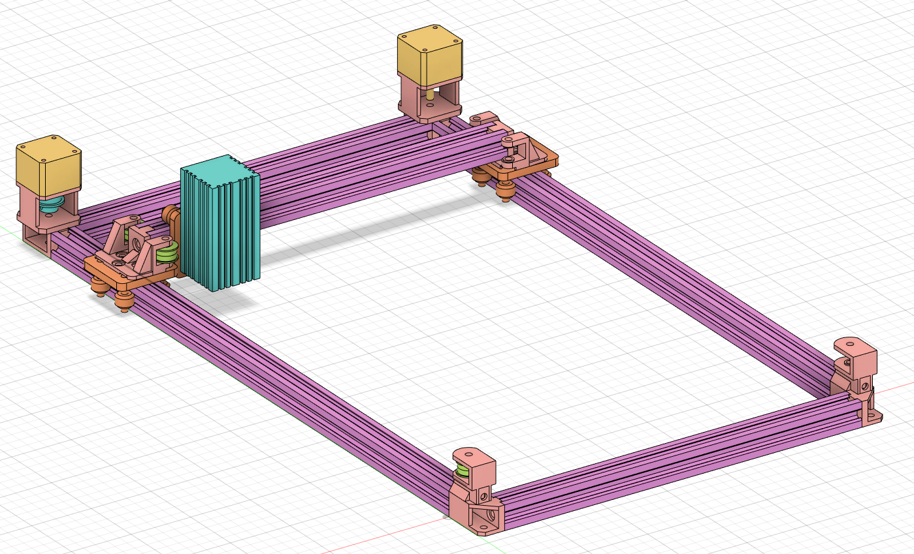

# CoreXY Laser Engraver
This is my repository to document my laser engraver project. It has gone through multiple iterations and currently is inspired by the [H-bot](https://openbuilds.com/?id=274) design.

## Design goals and constraints
* The XY-plane covered by the laser must be minimum 400 by 200 mm.
* The motors moving the laser on the XY-plane must be stationary.
* The laser must be able to cut 3mm multiplex, preferably 5mm.
* The machine must be rigid enough to not need fixture onto anything.
* The machine must be quiet enough to be used within my student studio.

## Current design overview

*All of the tan colored items in the picture above are 3D printed parts. Others are not.*

## Parts used
Not 3D printed:
* 2x 500mm 2020 Vslot extrusion
* 3x 300mm 2020 Vslot extrusion
* 3x [Mini Vslot gantry](https://grabcad.com/library/mini-v-gantry-kit-1)
* 12x [F625ZZ flanged ball bearing](https://reprap.org/wiki/Ball_bearing)
* 2x [Belt (G2T) Pulley 30 teeth](https://grabcad.com/library/gt2-timing-pulley-30-tooth-1)
* 1x [G2T timing belt](https://reprap.org/wiki/GT2_Timing_Belt)
* 2x [Nema 14 motors](https://www.omc-stepperonline.com/nema-14-stepper-motor/nema-14-bipolar-1-8deg-14ncm-20oz-in-0-4a-12v-35x35x26mm-4-wires.html)
* 1x 3.5 Watt laser module

3D printed:
* 2x motor and 2020 extrusion mount [Left](./3D_prints/2020_Motor_L.stl) and [Right](./3D_prints/2020_Motor_R.stl)
* 2x corner and 2020 extrusion mount [Left](./3D_prints/2020_Corner_L.stl) and [Right](./3D_prints/2020_Corner_R.stl)
* 2x [belt tensioner](./3D_prints/BeltTensioner.stl)
* 2x [Mini gantry carriage mount](./3D_prints/2020_Carriagemount.stl)
